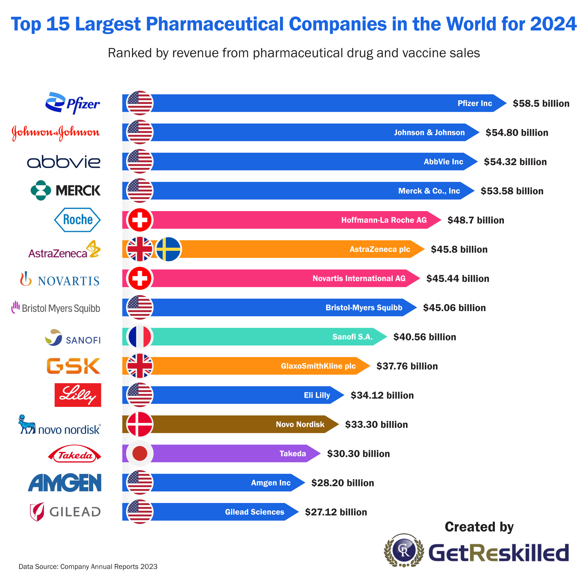
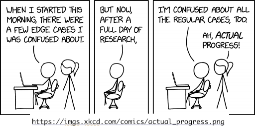

# Preamble {background-iframe="https://cicdguy.github.io/colored-particles/"}

## Acknowledgements

Partly based on the open-access article "The statistical software revolution in pharmaceutical development: challenges and opportunities in open source" ([Drug Discovery Today](https://www.sciencedirect.com/science/article/pii/S1359644626000188?via%3Dihub)) which is joint work with:

::: columns
::: {.column width="50%"}

- Heidi Seibold
- Anne-Laure Boulesteix
- Juliane Manitz
- Alessandro Gasparini
- Burak K. Günhan
- Oliver Boix

:::

::: {.column width="50%"}
- Armin Schüler
- Sven Fillinger
- Sven Nahnsen
- Anna E. Jacob
- Thomas Jaki
:::
:::

## Objective of this presentation

::: {.incremental}

- I would like to **inspire** you with my career path
- I would like to **motivate** you to improve your programming skills
- I would like you to **strive** to get yourself savvy in good software engineering practices and apply them in your projects
- I would like you to **influence** your statistics colleagues and departments in your organizations

:::

# My career path {background-iframe="https://cicdguy.github.io/colored-particles/"}

## My path to Statistics

::: {.incremental}

- I was good in math and I really liked stochastics   
  ("What is the chance of winning the lottery?")
- But I always had fun programming  
  (Remember those days of 
    [Basic](https://en.wikipedia.org/wiki/BASIC) and 
    [Turbo Pascal](https://en.wikipedia.org/wiki/Turbo_Pascal)?)
- I was also interested in medicine ...   
  ... but I could faint when watching somebody draw blood from my arm
- So I chose statistics because I could combine math and programming, 
  and work with medical data!
- I was formally trained as a statistician (B.Sc., M.Sc., Ph.D.)
- I started working at Roche as a biostatistician

:::

## Pharma industry and Roche

## What I did at Roche

::: {.incremental}

- I worked in early phase oncology studies and projects:
  - Dose escalation studies
  - Biomarker analyses
  - Discussions with medical doctors, regulatory experts, etc.
  - Clinical trial protocols, statistical analysis plans, etc.
- I also programmed a lot with R
  - Simulation studies for dose escalation designs
  - Developed R package for continual reassessment method (CRM) designs
:::

## What I did *not* do during those first years

::: {.incremental}

- I did *not* store my programs in version control systems
- I did *not* worry too much about making my code readable by others
- I did *not* try to make calculations reproducible
- I did *not* get any code review of my study design simulations 
- I did *not* write any unit tests for my packages

:::

## Some tricks I learned in Tech

::: {.incremental}

- After about 5 years I had the opportunity to switch gears and work at Google
- I learned a lot quickly about:
  - how to write unit tests
  - how to use a consistent code style  
  - how to write design documents
  - how to name functions
  - how to review code and respond to review feedback
  - how to check in code into the (internal) repository
- Also, but not that important:
  - how to write SQL queries, macros, unit tests for those
  - got to know memes and how to create new ones

:::

## But Pharma is more fun for me

::: {.incremental}

- I really liked that I did a lot of programming in a structured way in Google
- But I missed the scientific aspects from Pharma ...   
  ... where we deal not just with numbers, but also biology, medicine, patients, medical doctors, etc.
- And Roche just started venturing more into R territory, so I built up the Statistical Engineering team there from 2020 to 2024
  
:::

## Started RCONIS and Joined RPACT as Partner

::: {.incremental}

- Started working remotely for RCONIS mid-2024 from Taiwan
- RPACT builds statistical tools for drug development
- Main products: 
  - `rpact` (R package for clinical trial design and analysis)
  - `crmPack` (R package for dose escalation designs)
  - RPACT Cloud (web application for clinical trial design and analysis)
- Website: [rpact.com](https://rpact.com)

:::

# Programming is ubiquitous, but (still) neglected {background-iframe="https://cicdguy.github.io/colored-particles/"}

## (Almost) all statisticians are programming

::: {.incremental}

- We don't use calculators anymore, right?
- There are a lot of graphical tools that we can use for simple tasks ...  
  ... but it won't be sufficient for most biostatistics use cases
- We learn programming, maybe already in high school, or latest in undergraduate courses
- We wrangle, analyze, visualize, predict, ... data with code every day

:::

## But many don't take it serious enough

::: {.incremental}

- Most of the coding we do **alone** without any discussion or review
- We often **copy and paste** code from each other and adapt it every time
- We often shy away from sharing our code because we think it is too **ugly**
- We often don't take enough **time** to write clean code because we are too busy
- We often just develop code **locally** on our laptops
- We rarely use **version control** systems

:::

# Why is this (still) a problem? {background-iframe="https://cicdguy.github.io/colored-particles/"}

## Can we not just let LLMs do all the programming for us?

::: {.incremental}

- LLMs are great for generating some code for us, including R code of course ...
- But we still need to be the "conductor" of the agentic orchestra:
  - We need to know which structure of the package we want to build
  - We need to know which parts of the package are most critical and require which tests
  - We need to know how to review the LLM's suggested code and correct it when it's wrong
  - We need to ensure that we don't constantly repeat ourselves and know when to refactor code into reusable functions

:::

## Cannot handover to other statisticians

::: {.incremental}

- Statisticians (too) take vacations, go on longer leave, finish their PhD/PostDoc, etc.
- Then another statistician (peers, managers) needs to back up or take over the project
- They might need to revisit the design or analyses and thus need to **modify** the code
- Might not **find** the code at all (because not in a version controlled repository)
- Might not be able to **understand** the code (because unreadable by others)

:::

## Cannot maintain code

::: {.incremental}

- Not just switching between different statisticians, but also **over time**, things can become difficult
  - When I read code from one, two years ago, it is almost code from another person
  - If I look back at my quickly written, ugly code, which is not documented, I have a very hard time
- In the "copy and paste workflow", you can't help anybody else
  - If you discover **bugs**, those cannot be fixed across projects in one go
  - If you add **features**, they cannot be used by anybody else

:::

## Cannot prevent bugs

::: {.incremental}

- If we modify the code and don't have tests, we simply **don't know** if it still works correctly
- Typically we just run then the whole script again and if it does not fail with an error we think it is fine 
- But it might still produce **wrong results** due to new bugs
- And if we fix a bug, and don't add a test for it at the same time, it might **come back** later
- This is even more important in software packages that we create for us and others

:::

## Cannot reproduce results

::: {.incremental}

- When we don't prepare for it, new versions of software packages can lead to different results  
- Very hard to reproduce **manual steps**:
  - e.g. moving data around, running scripts, creating documents, etc.
  - would need to be thoroughly documented to have a small chance, but that is usually omitted
- But Statistics is a key component of the **scientific value chain** ...   
  ... thus has a responsibility to ensure reproducibility 

:::

## Cannot submit to external stakeholders

::: {.incremental}

- If we cannot share reliably internally in the company, then less so with external stakeholders
- So far, analyses that need to be shared with regulators are often rewritten by statistical programmers
  - Duplicates the work with original coding and has additional risk of introducing bugs
  - But is usually not done for study protocol contents (sample size, simulations)
- Often reporting code was translated to proprietary software because that was considered the only "validated" way
  - Still can have bugs in any software and the actual analysis scripts and macros

:::

# What can we do about it? {background-iframe="https://cicdguy.github.io/colored-particles/"}

## Become aware of the issues

::: {.incremental}

- Most statisticians actually have examples where lax programming led to such problems
- Let's realize that **a lot** is at stake:   
  we are not building airplanes that could fall from the sky ...   
  ... but we are impacting important decisions!
- For example, in a pharma company, it matters for patients that we 
  - calculate the **right** sample size of a clinical trial, 
  - more generally determine the **right** clinical trial design, 
  - help finding the **right** medicine candidates based on preclinical experiments, 
  - etc.

:::

## Become aware of the issues (cont'd)

](schwab-held-significance.png)

## Take software engineering seriously

::: {.incremental}

- We know what we should do, let's just take the time and energy to do it
- We can learn a lot from the statistical programmers:
  - organize ourselves with standards (starts with naming conventions for files and folders)
  - automate repetitive tasks (LLMs can help us to write tools for this)
  - consider double programming of key results
- Processes should consider code in the same priority as documents (statistical analysis plans etc.)
  - that implies code review, good and consistent code style, business continuity, ...
- Strive to be on par with Tech companies with regards to coding quality

:::

## Take software engineering seriously (cont'd)

](seibold-charlton-significance.png)

## Educate, educate, educate

::: {.incremental}

- Starts with **secondary schools**: 
  - computer science should become a standard subject, not just be an extra
  - same importance as math, geography, physics, etc.
- Continues at **university** with undergraduate and graduate programs:
  - computer science must become a key component of statistics and data science programs
  - good software engineering practices warrant dedicated courses
- Continues with **post-graduate** education during the work life:   
  online courses, software engineering workshops, conference sessions, etc.

:::

## Establish dedicated teams

::: {.incremental}

- **Research Software Engineering** (RSE) teams are now established in academia, including data science institutions
- Similarly pharma companies are establishing software engineering focused teams
- Direct focus is often development of reusable software
- We should not stop there but also strive to improve the **day to day work**:   
  biostatistics, medical writing, preclinical experiments, etc.
- Software engineering work is complex, so we need **top talents** for this

:::

## Collaborate across organizations

::: {.incremental}

- More **natural** now that we use R and other open source software
- Has become very **easy** in the last decade  
  (e.g. video conferencing, cloud based documents, code sharing platforms)
- Loosely coupled software modules allow to **"plug and play"**
  - combining different modules to make them fit company standards
  - connecting to internals via company specific extensions
- **Key opportunity** in contrast to previous proprietary software based, point-and-click, analyses

:::

# Just A Few Examples {background-iframe="https://cicdguy.github.io/colored-particles/"}

## Working group [`openstatsware`](https://openstatsware.org)

::: {.incremental}

- Has been founded in August 2022 as working group in the ASA Biopharmaceutical Section
- More than 50 members from over 30 pharma companies, CRO, etc.
  - open for new members
- Focuses on 
  1. building packages together (already on CRAN are [`mmrm`](https://cran.r-project.org/package=mmrm), [`brms.mmrm`](https://cran.r-project.org/package=brms.mmrm), [`maicplus`](https://cran.r-project.org/package=maicplus))
  2. disseminating good software engineering (SWE) practices (workshops, videos)     
:::

## Tools for reproducible research

Many great tools exist to help with reproducibility of statistical analyses
(see [CRAN task view](https://cran.r-project.org/web/views/ReproducibleResearch.html)), e.g.:

::: {.incremental}

- `Sweave` (2002)
- `knitr` and `Rmarkdown` (2014)
- `packrat` (2014)
- `officer` (2017)
- `usethis` (2017)
- `renv` (2019)
- `targets` (2020)
- `quarto` (2021)

:::

## Tools for package developers

Similarly lots of tools have been provided for package developers:

::: {.incremental}

- `testthat` (2009)
- `devtools` (2011)
- `checkmate` (2014)
- `lintr` (2014)
- `spelling` (2017)
- `styler` (2017)
- `pkgdown` (2018)
- `precommit` (2020)

:::

## Templates to start from use cases

Templates can be a great start to centralize code for reoccurring use cases, e.g.:

::: {.incremental}

- [TLG Catalog](https://insightsengineering.github.io/tlg-catalog/) 
- [Biomarker Analysis Catalog](https://insightsengineering.github.io/biomarker-catalog/)
- [RPACT Vignettes](https://www.rpact.com/vignettes) (Clinical trial design)
- [Mediana case studies](https://gpaux.github.io/Mediana/CaseStudies.html) (Simulations of trials)
- [Falcon](https://pharmaverse.github.io/falcon) (FDA Safety Tables and Figures)

:::

## Guidelines for good practices

::: {.incremental}

- [`rOpenSci`](https://ropensci.org/)
  - Non-profit initiative founded in 2011
  - Staff, process, guidelines for Statistical Software Peer Review of R packages
- [The Turing Way](https://the-turing-way.netlify.app/)
  - Started in 2019 as a guide for reproducibility (covering Version Control, Code Testing, and Continuous integration)
  - Now encompasses guides for Reproducible Research, Project Design, Communication, Collaboration, Ethical Research
- [`openstatsguide`](https://www.openstatsware.org/guide.html) with "Minimum Viable Good Practices for High Quality Statistical Software Packages"
  - Concise check list for building R, Python, Julia packages
  
:::

## Guidelines for good practices (cont'd)

::: {.incremental}

- ["Best practices in statistical computing"](https://doi.org/10.1002/sim.9169) (Sanchez et al., 2021)
  - 5 steps for implementing a code quality assurance (QA) process 
     1. adherence to clean and consistent code style
     2. clear written documentation (code, workflow, decisions)
     3. careful version control
     4. good data management
     5. regular testing and review
    
:::
  
## Workshops teaching good practices

::: {.incremental}

- ["Good Software Engineering Practices for R Packages"](https://rconsortium.github.io/asa-biop-swe-wg/blog/2023-gswe4rp-workshops-wrapup/)
  - `openstatsware` have run more than a dozen workshops across the globe since 2023!
- ["The Carpentries"](https://carpentries.org/)
  - Teaches foundational coding and data science skills to researchers worldwide
  - Teaching material on software, data, and library is available
- ["Making Data Science Work for Clinical Reporting"](https://www.coursera.org/learn/making-data-science-work-for-clinical-reporting)
  - Coursera course on how principles and methods from data science can be applied in clinical reporting

:::

# Conclusion {background-iframe="https://cicdguy.github.io/colored-particles/"}

## Conclusion

::: {.incremental}

- A **lot** in statistics depends on doing the programming well
- Now is **your** chance to get savvy with the tools and good practices yourselves
- You are the next generation of statisticians - use the **opportunity** to improve the way we work with code!

:::

## Thank you!

These slides are at [rpact-com.github.io/ghana-r-users-2026](https://rpact-com.github.io/ghana-r-users-2026)

Looking forward to connecting with you:
[linkedin.com/in/danielsabanesbove](https://www.linkedin.com/in/danielsabanesbove/)

